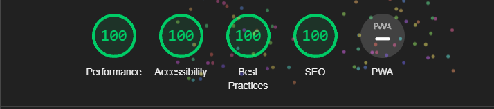

# [isabelroses.com](https://isabelroses.com)



## Development

To get started, clone the repository and install the dependencies:

```bash
git clone https://github.com/isabelroses/website
cd website

# Install dependencies (rejoice, nix users)
nix develop # if you have nix installed, not a requirement

go mod tidy

# tailwindcss
cd styles
bun install
# you may need to recompile tailwindcss
bun build
# but if you want tailwindcss to recompile on changes
bun watch

# then you can run the server using air
air # you can get this using `go install github.com/cosmtrek/air@latest`
```

### License

- All code is licensed under:
  [MIT](https://opensource.org/licenses/MIT)
- All blog posts are licensed under:
  [CC BY-NC-SA 4.0](https://creativecommons.org/licenses/by-nc-sa/4.0/)
